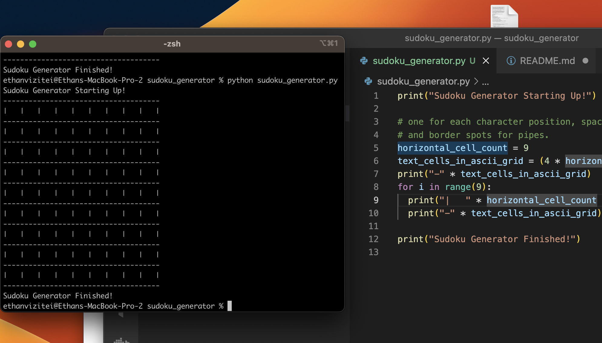

# sudoku_generator
Generate (probably) solvable sudoku puzzles.

## How to run
Make sure you have Python installed on your computer,
one reasonable place to start is:

`https://www.python.org/downloads/`

Make sure you have a terminal/command-line open .

- [Mac](https://www.howtogeek.com/682770/how-to-open-the-terminal-on-a-mac/)
- [Windows](https://support.kaspersky.com/common/windows/14637#block0)

Navigate to this directory in your terminal.

Run the program like: `python sudoku_generator.py`

You should see a blank grid because that's all we've implemented so far:

Now make some changes and run it again, see what happens.